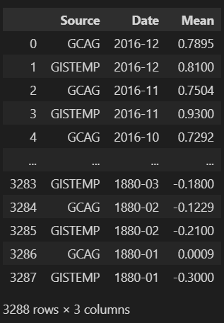
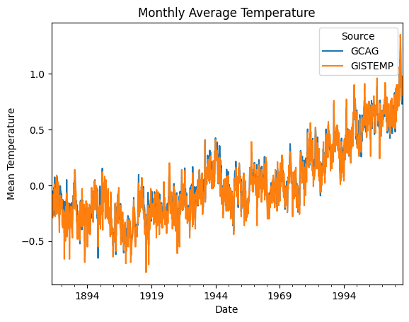
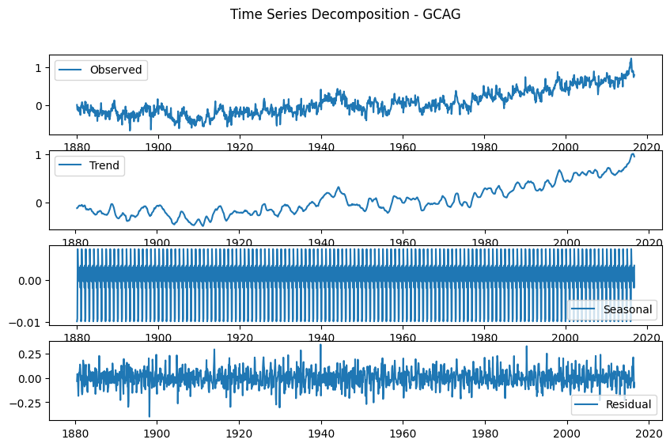
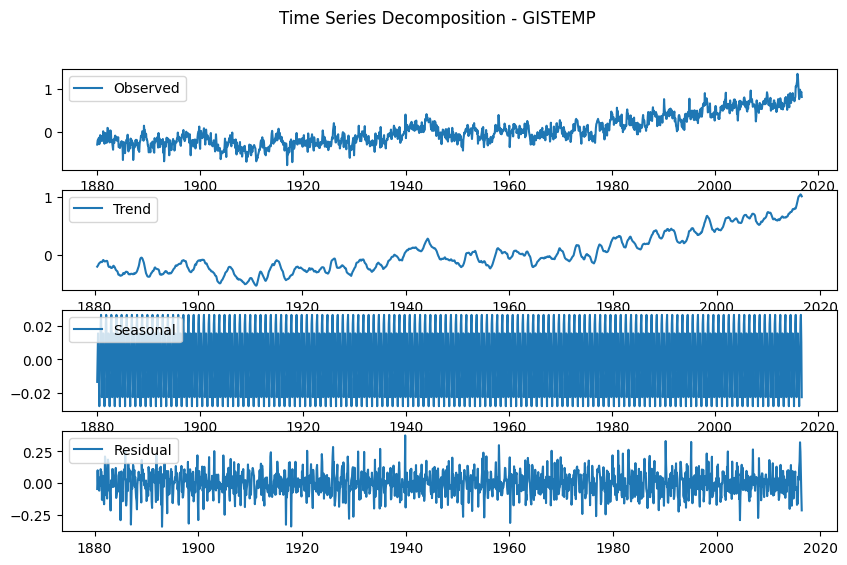

# Ex.No: 05  IMPLEMENTATION OF TIME SERIES ANALYSIS AND DECOMPOSITION
### Date: 


### AIM:
To Illustrates how to perform time series analysis and decomposition on the monthly average temperature of a city/country.

### ALGORITHM:
1. Import the required packages like pandas and numpy
2. Read the data using the pandas
3. Perform the decomposition process for the required data.
4. Plot the data according to need, either seasonal_decomposition or trend plot.
5. Display the overall results.

### PROGRAM:
#### NAME : YUVARAJ.S
#### REGISTER NUMBER : 212222240119
```PY
import pandas as pd
import matplotlib.pyplot as plt

data = pd.read_csv('monthly.csv')
data
df = pd.DataFrame(data)

df['Date'] = pd.to_datetime(df['Date'])

df_pivot = df.pivot(index='Date', columns='Source', values='Mean')

plt.figure(figsize=(10, 6))
df_pivot.plot()
plt.title('Monthly Average Temperature')
plt.xlabel('Date')
plt.ylabel('Mean Temperature')
plt.legend(title='Source')
plt.show()

from statsmodels.tsa.seasonal import seasonal_decompose
for column in df_pivot.columns:
    decomposition = seasonal_decompose(df_pivot[column], model='additive', period=12)
    
    plt.figure(figsize=(10, 6))

    plt.subplot(4, 1, 1)
    plt.plot(df_pivot.index, decomposition.observed, label='Observed')
    plt.legend()

    plt.subplot(4, 1, 2)
    plt.plot(df_pivot.index, decomposition.trend, label='Trend')
    plt.legend()

    plt.subplot(4, 1, 3)
    plt.plot(df_pivot.index, decomposition.seasonal, label='Seasonal')
    plt.legend()

    plt.subplot(4, 1, 4)
    plt.plot(df_pivot.index, decomposition.resid, label='Residual')
    plt.legend()

    plt.suptitle(f'Time Series Decomposition - {column}')
    plt.show()
```
### OUTPUT:
#### FIRST FIVE ROWS:


#### PLOTTING THE DATA:

#### SEASONAL PLOT TREND PLOT OVERALL REPRESENTATION :


### RESULT:
Thus we have created the python code for the time series analysis and decomposition.
